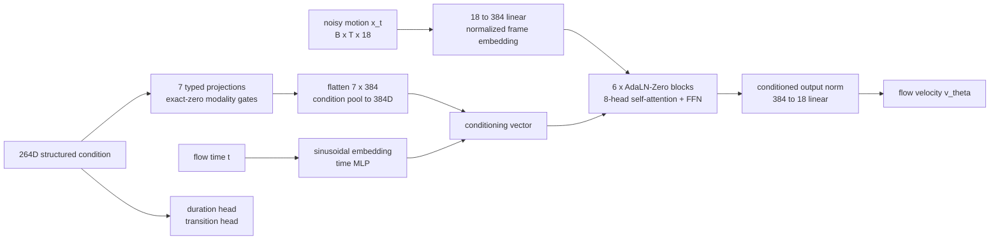

# ULA：情绪/意图条件化的机器人上半身动作生成

ULA（Upper-body Language-Action）把人体动作数据变成机器人上半身的条件式动作生成模型：

```text
动作捕捉数据（Kimodo 表演数据集 / BEAT2 语音手势 / InterAct 双人交互 / MotionX / Xsens ...）
    -> 人体 3D 骨架
    -> 重定向到机器人 URDF 上半身关节（15D 核心 / 18D 扩展契约）
    -> 质量检查 + 人工复核 + provenance lock（哈希绑定、许可证门禁）
    -> Flow Matching Transformer 条件式动作生成
    -> 关节限位/速度安全过滤
    -> MuJoCo 预览 / ROS2 真机执行
```

部署路径中，自由文本指令（中/英文）经 Qwen 语义适配器解析为行为/情绪标签；当前 18D 研发主干则使用冻结 Qwen 生成的动作描述与对话双路 embedding，并由条件 Flow Transformer 输出关节轨迹。

> 本文件是项目当前状态的总览。逐模块的代码地图见 [`docs/CODE_STRUCTURE.md`](docs/CODE_STRUCTURE.md)；`PROJECT_STRUCTURE.md` 是旧的 macOS 目录布局，已过时，忽略其中路径；2026-05 早期的 11 关节 MVP 规划文档搬到了 [`docs/roadmap/`](docs/roadmap/)，仅作历史参考。

## 效果演示

当前表现最好的 60 秒 BEAT2 对比演示：Ground Truth / 冻结 Qwen / LoRA Qwen。

[](training/runs/beat2_emotion_hierarchy_v7_qwen_ab_gt_60s/BEAT2_GT_vs_frozen_Qwen_vs_LoRA_Qwen_60s.mp4)

点击动画可打开[原始 MP4](training/runs/beat2_emotion_hierarchy_v7_qwen_ab_gt_60s/BEAT2_GT_vs_frozen_Qwen_vs_LoRA_Qwen_60s.mp4)。

## 1. 当前状态一览

| 部分 | 状态 | 说明 |
| --- | --- | --- |
| 15-DoF Kimodo MMDiT-lite | **已部署** | 136 维条件，5,000 步检查点；`--kimodo-qwen` 可从文本直连 MuJoCo |
| 18-DoF V5 masked multimodal AdaLN 主干 | **训练完成，候选可用** | 264 维条件、19,136,279 参数；120,000 步完成，best step 114,000，训练产物通过自身 formal-release gate，尚未替换 15D 部署入口 |
| V14.2 弱运动学语义适配 | **实验完成，禁止正式发布** | 冻结动作主干，仅训练约 1.97M 条件路径参数；6,000/6,000 步完成，但 receipt 标记 `experimental_unreviewed_unsafe` |
| V10 house-style raw-flow 适配器 | **pilot 完成，待独立评估** | 冻结 V5，仅训练 360 参数；100/100 步完成，best step 50，当前不具备视频或正式发布资格 |
| V11 counterfactual tempo 校准 | **门禁拒绝** | 200/200 步完成，但所有 milestone 均未满足方向/特征门禁，selected step 回退为 0 |
| V12 phase-transport 支路 | **代码实验** | 288 参数的 raw-flow 相位支路已实现；没有通过门禁的训练产物，不作为当前可用模型 |
| Qwen 文本-动作 latent 对齐（LoRA） | **探索性研究** | 独立训练轨道，尚未接入部署条件契约，见第 4.3 节 |

这里的“formal-release gate 通过”只表示训练数据、provenance 和数值门禁满足该 run 的发布契约，不等于已经进入机器人部署。部署默认仍是 15D MMDiT-lite；18D V5 及其 V10-V12 控制支路必须分别经过独立动作评审和真机安全验证。

## 2. 部署与研发模型边界

项目里有两条不能混用的运行路径：

1. **部署中的 Kimodo MMDiT-lite（136 维条件，15 关节）**——`training/runs/kimodo_mmdit_lite_qwen_compatible_5k_math_sdp/`，配合 Qwen 语义适配器通过 `pt_mujoco_infer` 直接推理到 MuJoCo，是目前唯一有完整交互式演示路径的模型。训练了 5,000 步（math SDPA backend），固定 162 episode 参考集上 loss 从 0.58138（step 1000）降到 0.40417（step 5000）。
2. **研发中的 18D V5 masked multimodal AdaLN（264 维条件）**——当前训练和适配工作的基础网络，支持原生变长 episode、动作描述/对话双文本通道、可缺失模态门控和 18D 头身联合生成。V10/V11/V12 都是在冻结 V5 的前提下增加极小的 raw-flow 控制支路，不是新的大模型主干。

## 3. 当前 18D 网络结构

当前主干类为 `UlaMMDiTV5MaskedMultimodalAdaLNModel`：18D 动作输入/输出、384 hidden、6 个 Transformer block、8 头 self-attention、FFN 宽度 1,536，共 19,136,279 参数。它沿用 MMDiT 项目的命名，但实际结构是单流 motion Transformer + AdaLN-Zero 条件调制，不是双流 MM-DiT，也没有 cross-attention。



264 维条件按语义拆成 7 个互不重叠的切片：

| 切片 | 维度 | 内容 |
| --- | --- | --- |
| Legacy | 92 | 兼容早期 intent / affect / gesture / text 条件；V13 无来源时保持全零 |
| Behavior | 27 | 可观察动作 one-hot |
| Emotion | 6 | neutral / sad / happy / angry / surprise / fear |
| Family | 8 | 行为所属大类 |
| Style | 3 | balance / amplitude / residual-tempo 连续物理控制 |
| Action description | 64 | 冻结 Qwen 动作描述 embedding 经固定正交投影所得，不训练映射头 |
| Dialogue | 64 | 冻结 Qwen 对话 embedding 经独立固定正交投影所得，不训练映射头 |

每个切片经独立两层 MLP 投影成一个 384D typed token；全零切片在投影后再次乘精确门控，从而连 projection bias 也不会泄漏“缺失模态”。7 个 token 展平后由 `2688→384→384` condition pool 汇合，并与 flow-time embedding 相加。这个 conditioning vector 为每个 AdaLN-Zero block 生成 attention/FFN 的 shift、scale 和 residual gate，因此条件与时间在所有层都被显式注入，而不是作为容易被忽略的 prefix token。

动作支路把 `[B,T,18]` 的 noisy joint state 线性映射到 384D，叠加按每条 episode 有效长度归一化的帧位置编码；变长 batch 使用连续前缀 mask，padding 同时从 attention 和 loss 中排除。输出经 condition-modulated LayerNorm 和 `384→18` 线性层得到 flow velocity。旁路 planner 从原始条件预测时长和 4 类 transition logits；当前 V13 训练只监督真实 episode 时长，未伪造 transition 标签。

V13 主干使用原生变长、按长度分桶的动态 microbatch。训练目标为 flow、position、velocity、acceleration、jerk，以及对头部三关节加权更高的对应损失，再加 duration loss；推理默认以 32 步 Euler 从高斯噪声积分，并在每步执行 joint-space clamp。

### 3.1 冻结主干上的控制支路

| 支路 | 条件宽度 | 新增参数 | 作用与当前结论 |
| --- | ---: | ---: | --- |
| V10 bandlimited output | 265 | 360 | 显式 selector 控制；对 V5 raw flow 施加有界 per-joint gain 和 4 个低频基函数残差。pilot 完成，待独立 raw32 评估 |
| V11 endpoint transport | 268 | 216 | 3 个物理控制 + selector；使用 endpoint pose、MA5 high-pass、MA11 high-pass 三组内容基。tempo pilot 未过门禁，当前有效选择为零支路 |
| V12 phase transport | 268 | 288 | 在 V11 三组内容基外增加中心化 phase basis，并将 content/tempo 参数分区。仅代码实验，无合格 checkpoint |

这些支路修改的是网络内部 raw flow，不是生成后的平滑、混合或播放速度变换；selector 为 0 时必须逐元素精确回到冻结 V5。任何 pilot 数值都不能替代正式动作评审。

## 4. Qwen 集成

### 4.1 语义适配器（已部署）

`upper_body_skeleton/semantic_adapter.py` 用冻结的 `Qwen/Qwen3-Embedding-0.6B` 把自由文本指令映射到 Kimodo 的 `(behavior_id, emotion_id)` 标签对（27×6=162 类），再查表得到对应的规范条件向量——Qwen 本身不直接输出动作，只做语义分类。训练时用两条不同指令让同一个 Qwen 实例分别编码"动作"和"情绪"语义，各取 128 维、L2 归一化后拼成 256 维，接 27 类行为 + 6 类情绪分类头。部署检查点在 162 条中文测试 prompt 上联合准确率 91.98%（行为 93.21%、情绪 98.77%）。详见 [`docs/qwen_semantic_adapter.md`](docs/qwen_semantic_adapter.md)、交互推理见 [`docs/pt_mujoco_infer.md`](docs/pt_mujoco_infer.md)。

### 4.2 V13 双文本条件缓存（18D 研发主干）

V13 不在线微调 Qwen，也不把 Qwen 放进动作生成器的反向传播图。冻结 Qwen 分别编码人工审核的 `action_description_text` 和 `dialogue_text`；两个角色各自通过固定随机种子生成的正交矩阵从 128D 投影到 64D，写入 hash-bound condition cache。没有审核文本的通道保持精确全零，并由 V5 modality gate 完全旁路。这样训练动作网络时 Qwen 权重和文本投影都固定，动作描述与对话也不会混成同一个 latent。

### 4.3 文本-动作 Latent 对齐（探索性，未接入部署）

`upper_body_skeleton/cross_modal_latent.py` / `motion_latent.py` 训练一个独立的、可微的文本-动作共享 latent 空间，作为未来"检索式/embedding 条件"路线的探索，**不是**对第 4.1 节部署路径的替代。冻结 Qwen3-Embedding-0.6B 用 rank-8 LoRA（top 4 层，q/k/v/o 投影）加文本投影头，输出 128 维归一化文本 latent；与同一个冻结 Motion Metric Encoder 输出的 128 维动作 latent 对齐。训练同时用双向检索、行为/情绪分类、对原始冻结动作编码器的 teacher anchoring，以及 VICReg 方差/协方差正则防止表征坍缩。

在 1,296 训练 / 162 验证 / 162 测试的 disjoint-paraphrase 划分上：text→motion Recall@1 21.0% / Recall@5 51.9%，motion→text Recall@1 24.7% / Recall@5 50.0%（median rank 5/162）；文本侧分类明显弱于第 4.1 节的专用适配器（行为 45.8%、情绪 66.7%），动作 latent 的 effective rank（19.6/128）也明显低于文本侧——这条线还在改进中。详见 [`docs/qwen_motion_latent_lora.md`](docs/qwen_motion_latent_lora.md)。

## 5. 数据集

- **Kimodo（15D 部署路径）**：27 行为 × 6 情绪 = 162 类，1,620 条 episode（约 2.25 小时），按 1296/162/162 划分 train/val/test 且保持类别分布。
- **BEAT2 dialogue-turn 18D V13（18D 主干）**：严格 speaker-disjoint、原生变长、hash-bound trajectory；motion-only 样本只提供真实存在的模态，不把缺失情绪或文本补成伪标签。
- **ULA0513 user-owned reviewed semantic set（18D 语义/风格适配）**：只接纳人工审核并通过 provenance lock 的动作、文本和物理风格控制；house-style selector 来自显式用户/API 开关，模型不得从文本或数据来源推断 selector。
- 其余来源（InterAct 双人交互、MotionX、Xsens BVH）由 `tools/gmr_v2/` 批量重定向进同一 15D/18D 关节契约。没有进入对应 allowlist/provenance lock 的来源不得用于正式训练。

## 6. 已验证结果与实验门禁

- **18D V5 foundation**：120,000/120,000 步完成，best step 114,000；validation total/flow/position = `1.06395 / 0.43294 / 0.08620`，test = `1.26852 / 0.44863 / 0.09224`。产物状态为 `adjudicated_posttrain_candidate`，其 formal-release gate 通过。
- **V14.2 semantic-path adapter**：6,000/6,000 步完成，validation total `0.53497`、test total `0.56938`；但训练范围为实验性 weak-semantic adapter，产物明确标为 `experimental_unreviewed_unsafe`，不能因为 loss 更低就替代 V5 正式候选。不同 loss 配方的 total 也不可横向当作同一指标排名。
- **V10 house-style pilot**：best step 50；raw32 median target MSE 从 `0.160491` 到 `0.160304`，ratio `0.998276`，p95 jerk ratio `1.00736`。变化幅度很小，下一步仍是独立 raw32 评估，当前禁止视频/正式发布。
- **V11 tempo pilot**：200/200 步完成；tempo direction fraction 为 0，target-feature 与方向门禁失败，`selected_step=0`、`stage_status=rejected_no_eligible_milestone`，不得宣称节奏控制已学会。
- **15D held-out / 跨域适配**：Kimodo 重建、BEAT2 跨域适配和 replay guard 结果仍适用于已部署旧路径，不能与 18D V5/V14 的目标函数数值直接比较。
- **实时推理**（RTX 5090，32 Euler 步，best-of-1，seed 7）：文本编码中位延迟 19.6 ms，端到端 65.0 ms，约 **46.2×** 实时；吞吐 2,001.3 帧/s，约 **66.7×** 实时。
- **安全过滤**：关节限位/速度限位过滤前后的违规率对比，以及 29 条动作的盲人审阅结果（24/29 接受，0/29 碰撞）。

## 7. 18-DoF 训练与部署现状

18D joint contract 仍保持 append-only：`retarget_v2_18d.py` = `JOINT_ORDER_15D + [head_roll, head_pitch, head_yaw]`（roll 限位 ±0.785 rad，pitch/yaw 限位 ±1.57 rad）。V5 foundation 已完成正式的原生变长多模态训练，不再是“尚未开始”的状态；当前 checkpoint 位于 `training/runs/beat2_ula0513_multimodal_v13_from_scratch_v1/training/ula_fm_checkpoint.pt`。

这不意味着 18D 已部署：当前 `pt_mujoco_infer --kimodo-qwen` 仍加载 15D MMDiT-lite。18D V5 需要单独接入推理入口并完成盲审、碰撞/限位/速度验证后才能替换部署路径；V10-V12 支路还需要各自通过独立门禁。

## 8. 快速开始

### 8.1 交互式推理（部署中的 136 维生成器 + Qwen 语义适配器）

需要图形会话（MuJoCo viewer），从有 X server 的客户端用 X11 转发连接：

```bash
ssh -Y gez@172.16.60.184
cd /home/gez/shuaiwang/ula-motion-generate

conda run --no-capture-output -n env_isaaclab \
  python -u -m upper_body_skeleton.pt_mujoco_infer \
  --kimodo-qwen \
  --device cuda \
  --semantic-device cuda \
  --semantic-local-files-only \
  --loops 1
```

输入一句中文/英文动作指令，回车即可看到 5 秒生成动作在 MuJoCo 中播放。无图形环境时用 `--no-viewer` 做纯推理健全性检查。完整参数与更多示例见 [`docs/pt_mujoco_infer.md`](docs/pt_mujoco_infer.md)、[`docs/qwen_semantic_adapter.md`](docs/qwen_semantic_adapter.md)。

### 8.2 运行测试

```bash
PYTEST_DISABLE_PLUGIN_AUTOLOAD=1 /home/gez/shuaiwang/.venvs/gmr/bin/python -m pytest -q tests/
```

## 9. 代码地图 / 文档索引

- 完整模块级代码地图：[`docs/CODE_STRUCTURE.md`](docs/CODE_STRUCTURE.md)（从这里开始找具体文件）。
- 早期 ULA MMDiT V2 prefix-token 架构文档（历史参考）：[`docs/ula_mmdit_v2_architecture.md`](docs/ula_mmdit_v2_architecture.md)。
- Qwen 语义适配器：[`docs/qwen_semantic_adapter.md`](docs/qwen_semantic_adapter.md)。
- Qwen 文本-动作 Latent LoRA：[`docs/qwen_motion_latent_lora.md`](docs/qwen_motion_latent_lora.md)。
- PT 直连 MuJoCo 推理：[`docs/pt_mujoco_infer.md`](docs/pt_mujoco_infer.md)。
- IROS 论文草稿（LaTeX，含架构图/训练流程图/推理流程图与算法伪代码）：[`paper/main.tex`](paper/main.tex)。
- 相关文献调研笔记：[`docs/references/emotional_gesture_literature_2026-05-15.md`](docs/references/emotional_gesture_literature_2026-05-15.md)。
- 2026-05 早期 11 关节 MVP 规划（历史参考，已被上面内容取代）：[`docs/roadmap/`](docs/roadmap/)。

## 10. 安全过滤

无论哪一代生成器，推理输出在送往仿真或真机前都必须经过同一套过滤：关节限位 clamp、速度限位（3 rad/s）、加速度限位、低通滤波、突变检测；真机首次播放使用低刚度/低幅度。这一步不可跳过，也不因架构升级而改变。
