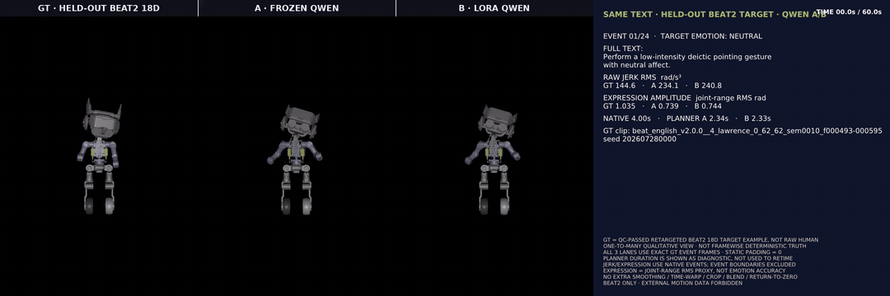

# ULA：情绪/意图条件化的机器人上半身动作生成

ULA（Upper-body Language-Action）把人体动作数据变成机器人上半身的条件式动作生成模型：

```text
动作捕捉数据（Kimodo 表演数据集 / BEAT2 语音手势 / InterAct 双人交互 / MotionX / Xsens ...）
    -> 人体 3D 骨架
    -> 重定向到机器人 URDF 上半身关节（15D 核心 / 18D 扩展契约）
    -> 质量检查 + 人工复核 + provenance lock（哈希绑定、许可证门禁）
    -> Flow Matching Transformer 条件式动作生成
    -> 关节限位/速度安全过滤
    -> MuJoCo 预览 / ROS2 真机执行
```

自由文本指令（中/英文）经 Qwen 语义适配器解析出行为/情绪标签，驱动生成器输出对应的关节轨迹。

> 本文件是项目当前状态的总览。逐模块的代码地图见 [`docs/CODE_STRUCTURE.md`](docs/CODE_STRUCTURE.md)；`PROJECT_STRUCTURE.md` 是旧的 macOS 目录布局，已过时，忽略其中路径；2026-05 早期的 11 关节 MVP 规划文档搬到了 [`docs/roadmap/`](docs/roadmap/)，仅作历史参考。

## 效果演示

当前表现最好的 60 秒 BEAT2 对比演示：Ground Truth / 冻结 Qwen / LoRA Qwen。

[](training/runs/beat2_emotion_hierarchy_v7_qwen_ab_gt_60s/BEAT2_GT_vs_frozen_Qwen_vs_LoRA_Qwen_60s.mp4)

点击动画可打开[原始 MP4](training/runs/beat2_emotion_hierarchy_v7_qwen_ab_gt_60s/BEAT2_GT_vs_frozen_Qwen_vs_LoRA_Qwen_60s.mp4)。

## 1. 当前状态一览

| 部分 | 状态 | 说明 |
| --- | --- | --- |
| 15-DoF 核心生成器（腰 3 + 双臂 12） | **已验证** | held-out 重建、跨域适配、实时推理、安全过滤都有完整数值（见第 5、6 节） |
| 部署入口（Qwen 语义适配器 + PT→MuJoCo 直连推理） | **已部署** | `--kimodo-qwen`，136 维条件、15 关节、5,000 步收敛检查点 |
| 18-DoF 扩展（+头部 roll/pitch/yaw） | **进行中** | append-only 架构已就绪（`retarget_v2_18d.py`、`ula_v2_18d_head.py`），正式监督训练尚未完成，见第 7 节 |
| Qwen 文本-动作 latent 对齐（LoRA） | **探索性研究** | 独立训练轨道，尚未接入部署条件契约，见第 4.2 节 |
| ULA MMDiT V2 结构化条件（264 维） | **训练中的新一代架构** | 与当前部署的 136 维契约并存，尚未替换部署路径 |

**不要**把 `beat2_18d_from_scratch_formal_v1` 之类的 18D 正式训练 run 当作已完成结果引用——其自身 provenance 记录里 `behavior_supervised_count` / `emotion_supervised_count` 仍为 0，说明监督训练还没真正跑起来。IROS 论文草稿（[`paper/main.tex`](paper/main.tex)）里对这一点有详细、如实的说明。

## 2. 两代生成器

项目里同时存在两代 Flow Matching 生成器，不要混用：

1. **部署中的 Kimodo MMDiT-lite（136 维条件，15 关节）**——`training/runs/kimodo_mmdit_lite_qwen_compatible_5k_math_sdp/`，配合 Qwen 语义适配器通过 `pt_mujoco_infer` 直接推理到 MuJoCo，是目前唯一有完整交互式演示路径的模型。训练了 5,000 步（math SDPA backend），固定 162 episode 参考集上 loss 从 0.58138（step 1000）降到 0.40417（step 5000）。
2. **ULA MMDiT V2 / 论文草稿中的 "ULA-GesFormer"（264 维结构化条件，15D 核心 + 18D 扩展）**——`upper_body_skeleton/ula_training_v2.py` 等模块，是当前正在训练、评估更完整的下一代架构，详见第 3 节。它还没有替换第一代的部署入口。

## 3. ULA MMDiT V2 架构（264 维结构化条件）

条件向量按语义拆成 6 个切片，共 264 维：

| 切片 | 维度 | 内容 |
| --- | --- | --- |
| Legacy | 92 | 兼容早期条件编码 |
| Behavior | 27 | Kimodo 27 类行为 one-hot |
| Emotion | 6 | neutral / sad / happy / angry / surprise / fear |
| Family | 8 | 行为所属大类 |
| Style | 3 | 连续风格控制（幅度/速度/张力一类） |
| Motion prototype | 128 | 冻结 Motion Metric Encoder 输出的、按 (behavior, emotion) 聚合的动作原型，训练/验证/测试严格不泄漏 |

每个切片独立投影后拼成 7 个条件 token（384 维），与噪声动作序列的 $T$ 个 motion token（同样 384 维，叠加 flow-time 与帧位置编码）拼接，输入 6 层 Pre-LN Transformer Encoder（8 头、单流双向自注意力，没有交叉注意力分支）。输出层丢弃条件 token，把动作位置解码成速度场 $v_\theta(x_t, t, c)$。15-DoF 核心模型共 12,394,004 参数；18-DoF 扩展以 append-only 方式追加少量输入/输出权重，总计 12,396,311 参数。

训练目标是多任务 flow-matching loss：flow MSE + 位置 Smooth-L1 + 速度/加速度 + 48 维运动学描述子 + 动作 latent 余弦距离 + 时长回归，固定权重 `1.0 / 0.25 / 0.01 / 0.0005 / 0.001 / 0.1 / 0.1`。推理用 Euler 积分（默认 32 步）从高斯噪声出发，每步 clamp 到归一化关节范围，末尾经去归一化 + 关节限位/3 rad·s⁻¹ 速度限位安全过滤。

架构图、训练/推理流程图、完整公式与超参数见论文草稿 [`paper/main.tex`](paper/main.tex)（Section IV）；原始设计文档见 [`docs/ula_mmdit_v2_architecture.md`](docs/ula_mmdit_v2_architecture.md)。

## 4. Qwen 集成

### 4.1 语义适配器（已部署）

`upper_body_skeleton/semantic_adapter.py` 用冻结的 `Qwen/Qwen3-Embedding-0.6B` 把自由文本指令映射到 Kimodo 的 `(behavior_id, emotion_id)` 标签对（27×6=162 类），再查表得到对应的规范条件向量——Qwen 本身不直接输出动作，只做语义分类。训练时用两条不同指令让同一个 Qwen 实例分别编码"动作"和"情绪"语义，各取 128 维、L2 归一化后拼成 256 维，接 27 类行为 + 6 类情绪分类头。部署检查点在 162 条中文测试 prompt 上联合准确率 91.98%（行为 93.21%、情绪 98.77%）。详见 [`docs/qwen_semantic_adapter.md`](docs/qwen_semantic_adapter.md)、交互推理见 [`docs/pt_mujoco_infer.md`](docs/pt_mujoco_infer.md)。

### 4.2 文本-动作 Latent 对齐（探索性，未接入部署）

`upper_body_skeleton/cross_modal_latent.py` / `motion_latent.py` 训练一个独立的、可微的文本-动作共享 latent 空间，作为未来"检索式/embedding 条件"路线的探索，**不是**对第 4.1 节部署路径的替代。冻结 Qwen3-Embedding-0.6B 用 rank-8 LoRA（top 4 层，q/k/v/o 投影）加文本投影头，输出 128 维归一化文本 latent；与同一个冻结 Motion Metric Encoder 输出的 128 维动作 latent 对齐。训练同时用双向检索、行为/情绪分类、对原始冻结动作编码器的 teacher anchoring，以及 VICReg 方差/协方差正则防止表征坍缩。

在 1,296 训练 / 162 验证 / 162 测试的 disjoint-paraphrase 划分上：text→motion Recall@1 21.0% / Recall@5 51.9%，motion→text Recall@1 24.7% / Recall@5 50.0%（median rank 5/162）；文本侧分类明显弱于第 4.1 节的专用适配器（行为 45.8%、情绪 66.7%），动作 latent 的 effective rank（19.6/128）也明显低于文本侧——这条线还在改进中。详见 [`docs/qwen_motion_latent_lora.md`](docs/qwen_motion_latent_lora.md)。

## 5. 数据集

- **Kimodo（主训练集）**：27 行为 × 6 情绪 = 162 类，1,620 条 episode（约 2.25 小时），按 1296/162/162 划分 train/val/test 且保持类别分布。
- **BEAT2（跨域适配 + 18D 预训练池）**：用严格 speaker-disjoint 划分对 Kimodo 训练好的模型做跨域微调，并配 replay guard 检测灾难性遗忘；同时是 18-DoF 大规模 motion-only 预训练池的数据来源（当前该池尚无行为/情绪监督标注，见第 7 节）。
- 其余来源（InterAct 双人交互、MotionX、Xsens BVH）由 `tools/gmr_v2/` 批量重定向进同一 15D/18D 关节契约，属于 18D 扩展与交互场景的数据扩充，非当前部署路径依赖。

## 6. 已验证的核心指标（15-DoF）

- **Held-out 重建**（Kimodo）：General / LoRA（文本条件）/ LoRA（中文 paraphrase）三种条件下的位置、速度、幅度 RMSE，见论文 Table VI-A。
- **跨域适配（BEAT2）**：val/test loss 显著下降，replay guard 未触发遗忘告警（单种子诊断，尚无多种子方差）。
- **实时推理**（RTX 5090，32 Euler 步，best-of-1，seed 7）：文本编码中位延迟 19.6 ms，端到端 65.0 ms，约 **46.2×** 实时；吞吐 2,001.3 帧/s，约 **66.7×** 实时。
- **安全过滤**：关节限位/速度限位过滤前后的违规率对比，以及 29 条动作的盲人审阅结果（24/29 接受，0/29 碰撞）。

## 7. 18-DoF 头部扩展：现状

append-only 设计：`retarget_v2_18d.py` = `JOINT_ORDER_15D + [head_roll, head_pitch, head_yaw]`（roll 限位 ±0.785 rad，pitch/yaw 限位 ±1.57 rad），不改动已训练好的 15D 关节顺序和权重。`ula_v2_18d_head.py` / `ula_v2_18d_random_init.py` / `ula_v2_18d_posttrain.py` 构成模型契约、无热启动的严格随机初始化、以及可审计的训练循环；`tools/train_ula_v2_18d_formal_from_scratch.py` 是正式、带 provenance lock 与许可证门禁的训练入口（`--stage audit|initialize|cache|train`），拒绝热启动、拒绝固定/裁剪时长、拒绝未审核数据。

截至目前，18D 的大规模 motion-only 预训练池还没有行为/情绪监督标注，正式监督训练还未真正开始——**在有真正跑完的、监督的训练结果之前，不要把任何 18D "最终"数值当作已完成结论**。这个状态会随训练推进变化，请以 `training/runs/beat2_18d_from_scratch_formal_v1/training/training_summary.json` 之类文件里的 `behavior_supervised_count` / `emotion_supervised_count` 字段和 provenance lock 的 `license_gate` / `user_confirmation` 为准，而不是本文件里的静态描述。

## 8. 快速开始

### 8.1 交互式推理（部署中的 136 维生成器 + Qwen 语义适配器）

需要图形会话（MuJoCo viewer），从有 X server 的客户端用 X11 转发连接：

```bash
ssh -Y gez@172.16.60.184
cd /home/gez/shuaiwang/ula-motion-generate

conda run --no-capture-output -n env_isaaclab \
  python -u -m upper_body_skeleton.pt_mujoco_infer \
  --kimodo-qwen \
  --device cuda \
  --semantic-device cuda \
  --semantic-local-files-only \
  --loops 1
```

输入一句中文/英文动作指令，回车即可看到 5 秒生成动作在 MuJoCo 中播放。无图形环境时用 `--no-viewer` 做纯推理健全性检查。完整参数与更多示例见 [`docs/pt_mujoco_infer.md`](docs/pt_mujoco_infer.md)、[`docs/qwen_semantic_adapter.md`](docs/qwen_semantic_adapter.md)。

### 8.2 运行测试

```bash
PYTEST_DISABLE_PLUGIN_AUTOLOAD=1 /home/gez/shuaiwang/.venvs/gmr/bin/python -m pytest -q tests/
```

## 9. 代码地图 / 文档索引

- 完整模块级代码地图：[`docs/CODE_STRUCTURE.md`](docs/CODE_STRUCTURE.md)（从这里开始找具体文件）。
- ULA MMDiT V2 架构设计文档：[`docs/ula_mmdit_v2_architecture.md`](docs/ula_mmdit_v2_architecture.md)。
- Qwen 语义适配器：[`docs/qwen_semantic_adapter.md`](docs/qwen_semantic_adapter.md)。
- Qwen 文本-动作 Latent LoRA：[`docs/qwen_motion_latent_lora.md`](docs/qwen_motion_latent_lora.md)。
- PT 直连 MuJoCo 推理：[`docs/pt_mujoco_infer.md`](docs/pt_mujoco_infer.md)。
- IROS 论文草稿（LaTeX，含架构图/训练流程图/推理流程图与算法伪代码）：[`paper/main.tex`](paper/main.tex)。
- 相关文献调研笔记：[`docs/references/emotional_gesture_literature_2026-05-15.md`](docs/references/emotional_gesture_literature_2026-05-15.md)。
- 2026-05 早期 11 关节 MVP 规划（历史参考，已被上面内容取代）：[`docs/roadmap/`](docs/roadmap/)。

## 10. 安全过滤

无论哪一代生成器，推理输出在送往仿真或真机前都必须经过同一套过滤：关节限位 clamp、速度限位（3 rad/s）、加速度限位、低通滤波、突变检测；真机首次播放使用低刚度/低幅度。这一步不可跳过，也不因架构升级而改变。
