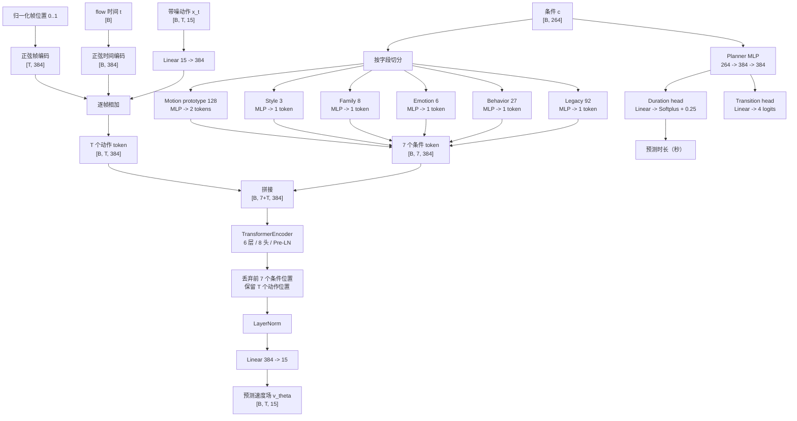
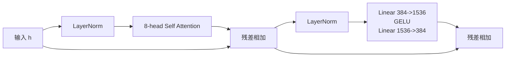
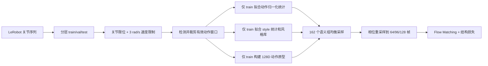
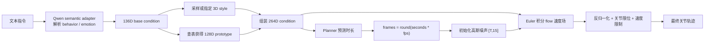

# ULA MMDiT V2 网络结构学习笔记

本文描述仓库中当前 50k 训练使用的 `ula_mmdit_v2`，以实际代码和
`configs/train_kimodo_ula_v2_general.yaml` 为准。

## 1. 一句话理解

这个模型学习一个条件速度场：给定带噪的上半身关节序列、flow 时间 `t` 和语义条件，
预测应该沿哪个方向移动，最终把高斯噪声逐步变成一段机器人动作。

核心规格：

| 项目 | 当前值 |
| --- | ---: |
| 动作维度 | 15 |
| 条件维度 | 264 |
| 隐藏维度 | 384 |
| 条件 token 数 | 7 |
| Transformer 层数 | 6 |
| 注意力头数 | 8 |
| 每头维度 | 48 |
| FFN 中间维度 | 1536 |
| 参数量 | 12,394,004 |
| 训练帧数选择 | 64、96、128 |
| 推理默认 flow 步数 | 32 |

> 名字里虽然有 MMDiT，但当前实现不是经典的双流 MMDiT block。它把条件 token 和动作
> token 拼成一个序列，再送入单流 `TransformerEncoder` 做全局自注意力。

## 2. 模型控制哪些电机

每一帧是 15 个关节角，单位为弧度：

| 下标 | 关节 | 部位 |
| ---: | --- | --- |
| 0 | `joint_pelvisYaw` | 腰部 yaw |
| 1 | `joint_pelvisPitch` | 腰部 pitch |
| 2 | `joint_pelvisRoll` | 腰部 roll |
| 3 | `joint_lShoulderPitch` | 左肩 pitch |
| 4 | `joint_lShoulderRoll` | 左肩 roll |
| 5 | `joint_lShoulderYaw` | 左肩 yaw |
| 6 | `joint_lElbow` | 左肘 |
| 7 | `joint_lWristRoll` | 左腕 roll |
| 8 | `joint_lWristPitch` | 左腕 pitch |
| 9 | `joint_rShoulderPitch` | 右肩 pitch |
| 10 | `joint_rShoulderRoll` | 右肩 roll |
| 11 | `joint_rShoulderYaw` | 右肩 yaw |
| 12 | `joint_rElbow` | 右肘 |
| 13 | `joint_rWristRoll` | 右腕 roll |
| 14 | `joint_rWristPitch` | 右腕 pitch |

因此当前模型是“腰部 3 + 左臂 6 + 右臂 6”。它不输出头部、眼睛、耳朵和手指电机。

## 3. 总体结构图



## 4. 264 维条件是怎么组成的

条件向量不是直接用一个大 MLP 压成 7 个 token，而是按语义含义分别投影：

| 切片 | 维度 | 内容 | 输出 token |
| --- | ---: | --- | ---: |
| `[0:92]` | 92 | legacy 语义和文本特征 | 1 |
| `[92:119]` | 27 | `behavior_id` one-hot | 1 |
| `[119:125]` | 6 | `emotion_id` one-hot | 1 |
| `[125:133]` | 8 | behavior family one-hot | 1 |
| `[133:136]` | 3 | 动作风格控制量 | 1 |
| `[136:264]` | 128 | Motion Metric 动作原型 | 2 |

合计：

```text
92 + 27 + 6 + 8 + 3 + 128 = 264
1  + 1  + 1 + 1 + 1 + 2   = 7 tokens
```

### 4.1 Legacy 92 维

前 92 维继续保留旧模型的条件表达：

```text
intent one-hot          6
affect one-hot          8
motion style one-hot    3
gesture one-hot         6
连续标量                 5
固定文本特征             64
--------------------------
总计                    92
```

### 4.2 三个 style controls

V2 会把旧 Kimodo 条件最后 3 个控制位替换成从动作中计算的风格特征：

1. `signed_arm_balance`：左右臂活动的不对称程度。
2. `log_arm_amplitude`：双臂动作幅度的 `log1p`。
3. `log_arm_speed`：双臂速度的 `log1p`。

均值和标准差只在 train split 上拟合，然后做标准化并裁剪到 `[-5, 5]`。推理时可以从
相同 behavior/emotion 的训练风格库中按 seed 采样，也可以使用均值或显式传入三个值。

### 4.3 Motion prototype 128 维

固定的 Motion Metric Encoder 先把训练动作编码成 128 维单位向量。对每个
`behavior_id x emotion_id` 组求均值并再次 L2 归一化，得到该组的动作原型。

这里有两个关键点：

- 原型只由 train split 计算，validation/test 不参与，避免数据泄漏。
- 推理 checkpoint 已保存原型表，因此部署生成器时不需要再次运行 Motion Metric Encoder。

### 4.4 各条件投影器

除动作原型外，每个投影器结构都是：

```text
Linear(input_dim, 384) -> SiLU -> Linear(384, 384)
```

动作原型要生成 2 个 token，因此结构为：

```text
Linear(128, 768) -> SiLU -> Linear(768, 768)
reshape -> [B, 2, 384]
```

独立投影的好处是网络在进入注意力层前就知道“这是行为”“这是情绪”“这是风格”，
而不是要求一个共享 MLP 自己从 264 个位置中重新发现字段边界。

## 5. 动作 token 如何构造

训练目标动作先使用 train split 的逐关节均值和标准差归一化。flow 插值得到的带噪动作
`x_t` 形状为 `[B, T, 15]`。

每一帧经过：

```text
motion_token = Linear_15_to_384(x_t)
             + sinusoidal_flow_time(t)
             + sinusoidal_frame_position(frame_index / (T - 1))
```

时间编码回答“当前从噪声走到数据的第几阶段”，帧位置编码回答“这是整段动作中的哪个
相位”。两种编码都没有可训练参数，频率范围按指数从 1 到 1000。

## 6. Transformer 主干

7 个条件 token 放在前面，T 个动作 token 放在后面：

```text
[legacy, behavior, emotion, family, style, prototype_1, prototype_2,
 frame_1, frame_2, ..., frame_T]
```

主干是 6 个 PyTorch `TransformerEncoderLayer`：



重要实现细节：

- `norm_first=True`，即 Pre-LN。
- 8 个注意力头，每头 `384 / 8 = 48` 维。
- 没有 causal mask，任意动作帧都能关注过去和未来帧。
- 条件和动作使用同一个 self-attention，因此动作帧可以直接读取任意条件 token。
- PyTorch 默认 dropout 为 0.1。
- CUDA 上强制使用 math SDPA，以规避该工程中曾出现的 backward 数值不稳定。
- 注意力复杂度约为 `O((T + 7)^2)`。

经过 6 层后，只保留后面的 T 个动作位置，再执行：

```text
LayerNorm(384) -> Linear(384, 15) -> predicted velocity field
```

注意：这里“一帧是一个 token”，不是“一个关节是一个 token”。同一帧的 15 个关节先被
线性层混合成一个 384 维向量。

## 7. 用生产 batch 跟踪一次张量尺寸

以当前最重训练形状 `B=64, T=128` 为例：

| 阶段 | 张量形状 |
| --- | --- |
| 目标动作 `x` | `[64, 128, 15]` |
| 高斯噪声 `z` | `[64, 128, 15]` |
| flow 时间 `t` | `[64]` |
| 带噪动作 `x_t` | `[64, 128, 15]` |
| 动作 embedding | `[64, 128, 384]` |
| 条件向量 `c` | `[64, 264]` |
| 条件 token | `[64, 7, 384]` |
| 拼接序列 | `[64, 135, 384]` |
| 每头 Q/K/V | `[64, 8, 135, 48]` |
| 每层注意力矩阵 | `[64, 8, 135, 135]` |
| 主干输出 | `[64, 135, 384]` |
| 保留动作位置 | `[64, 128, 384]` |
| 预测速度场 | `[64, 128, 15]` |

## 8. Flow Matching 训练目标

设：

- `x` 是归一化后的真实动作。
- `z ~ N(0, I)` 是高斯噪声。
- `t ~ Uniform(0, 1)`。

训练插值路径为：

```math
x_t = (1-t)z + tx
```

这条直线路径的真实速度场是常量：

```math
v^*(x_t, t, c) = x - z
```

网络预测 `v_theta(x_t, t, c)`。为了从任意 `t` 直接估计终点，还计算：

```math
x_hat = x_t + (1-t)v_theta(x_t, t, c)
```

### 8.1 当前总损失

```text
L = 1.0    * L_flow
  + 0.25   * L_position
  + 0.01   * L_velocity
  + 0.0005 * L_acceleration
  + 0.001  * L_descriptor
  + 0.1    * L_motion_latent
  + 0.1    * L_duration
```

| 损失 | 含义 |
| --- | --- |
| `flow` | `MSE(v_theta, x-z)`，最核心的生成目标 |
| `position` | `SmoothL1(x_hat, x)`，约束直接重建位置 |
| `velocity` | 约束相邻帧一阶差分 |
| `acceleration` | 约束二阶差分，减少突变 |
| `descriptor` | 对齐幅度、速度、加速度、左右臂活动和平衡等 48 维统计量 |
| `motion_latent` | 固定 Motion Metric Encoder 中预测动作与真实动作 embedding 的余弦距离 |
| `duration` | 对齐 `log1p(预测秒数)` 和 `log1p(真实秒数)` |

位置、速度、加速度和 descriptor 在归一化关节空间中计算，但差分使用真实动作时长得到的
`dt`。Motion Metric loss 会先把动作反归一化回弧度。

### 8.2 自动时长分支

同一个 264 维条件还进入独立 planner：

```text
condition [B,264]
  -> Linear(264,384)
  -> SiLU
  -> Linear(384,384)
  -> SiLU
  -> Linear(384,1)
  -> Softplus + 0.25
  -> duration_sec [B]
```

`+0.25` 保证预测时长至少为正。推理时还会把结果裁剪到训练时长契约的最小值和最大值。

模型也定义了 4 类 `transition_head`（continue、emotion change、action change、end），但当前
V2 objective 只读取 `duration_sec`，没有 transition loss。因此 **当前训练中的
`transition_head` 没有得到监督，不能把它的 logits 当作有效预测使用**。

## 9. 数据进入网络前经历什么



当前数据集共 1,620 个 episode，严格切分为：

| split | episode 数 |
| --- | ---: |
| train | 1,296 |
| validation | 162 |
| test | 162 |

Kimodo 有 27 个 behavior 和 6 个 emotion，共 `27 * 6 = 162` 个语义组。采样器先均匀轮换
语义组，再以 0.5 的概率按左右偏向和动作幅度 mode 分桶采样，避免常见标签或常见动作幅度
主导训练。

清洗配置中 `smooth_window=1`，等价于不做移动平均；仍会执行关节范围和 3 rad/s 速度限制。
训练 batch 中的原始可变长度动作按相位重采样为 64、96 或 128 帧，但真实秒数单独保留，
供速度、加速度和 duration loss 使用。

## 10. 推理时如何从文本得到动作



Qwen semantic adapter 是生成器上游的文本解析器，不在这 12.39M 生成网络内部。它主要解析
behavior/emotion 并选择兼容的 base condition。部署时：

- 需要生成器 checkpoint 中保存的条件契约、style bank 和 prototype bank。
- 不需要再次加载 Motion Metric Encoder 来生成普通动作。
- 若使用自由文本解析，则需要 semantic adapter；若直接提供结构化标签，可以用基础条件构造器。

### 10.1 Euler 采样

推理从归一化关节范围内的高斯噪声开始。若采样步数是 `N`：

```text
dt = 1 / N
x = Gaussian noise

for i = 0 ... N-1:
    t = i * dt
    v = model(x, t, condition)
    x = clamp(x + dt * v, normalized_joint_limits)
```

完成后反归一化到弧度，再执行后处理。默认 `N=32`；步数越大通常积分越细，但推理也越慢。

## 11. 参数量分解

| 模块 | 参数量 |
| --- | ---: |
| 6 层 Transformer | 10,646,784 |
| 6 个条件投影器 | 1,483,008 |
| 动作输入 Linear | 6,144 |
| 输出 LayerNorm + Linear | 6,543 |
| Planner MLP | 249,600 |
| Duration head | 385 |
| Transition head | 1,540 |
| **总计** | **12,394,004** |

约 85.9% 的参数位于 Transformer 主干。正弦时间编码和帧编码没有参数。

## 12. 优化与 checkpoint

当前 50k 配置：

| 项目 | 值 |
| --- | ---: |
| batch size | 64 |
| 初始目标学习率 | `1e-4` |
| warmup | 1,000 steps |
| 调度 | warmup 后 cosine decay |
| 最低学习率比例 | 0.1 |
| AdamW weight decay | `1e-4` |
| 梯度裁剪 | global norm 1.0 |
| EMA decay | 0.999 |
| validation/checkpoint 间隔 | 500 steps |

保存的两个主要文件含义不同：

- `ula_fm_checkpoint.pt`：验证集最佳的 EMA 权重，适合推理。
- `last.pt`：周期保存点，包含 EMA、原始训练权重、optimizer、随机数和 sampler 状态，适合精确续训。

## 13. 当前实现边界

学习结构时要区分“当前真实实现”和“将来可能扩展的设计”：

1. 输出只有腰部和双臂 15 维，没有头部和手指。
2. 一帧只有一个动作 token，并没有为 15 个关节分别建 token。
3. 条件与动作是拼接后的单流 self-attention，不是双流 cross-attention MMDiT。
4. attention 是双向的，不是自回归、不是 causal Transformer。
5. planner 的 duration head 已训练，transition head 当前未训练。
6. 训练通过相位重采样支持多帧数，而不是在同一 batch 内使用 padding mask 保存每条原生长度。
7. 生成器学习的是关节角轨迹，不直接学习力矩、电流或底层电机控制律。

## 14. 推荐的源码阅读顺序

1. `upper_body_skeleton/retarget_v2.py:9`：15 个输出关节及其限制。
2. `upper_body_skeleton/ula_v2_conditioning.py:810`：数据清洗、split、style 和 prototype 如何组装。
3. `upper_body_skeleton/ula_training.py:484`：`UlaMMDiTV2Model` 网络本体。
4. `upper_body_skeleton/ula_training_v2.py:260`：batch 张量和多帧数重采样。
5. `upper_body_skeleton/ula_training_v2.py:310`：完整 V2 objective。
6. `upper_body_skeleton/ula_training_v2.py:531`：优化器、EMA、验证和 checkpoint 训练循环。
7. `upper_body_skeleton/ula_training.py:729`：Euler flow 采样器。
8. `upper_body_skeleton/pt_mujoco_infer.py:330`：style/prototype 条件组装和自动时长推理。

读代码时建议一直写下每个张量的形状。这个模型最重要的四个形状是：

```text
动作输入       [B, T, 15]
条件输入       [B, 264]
Transformer   [B, T+7, 384]
速度场输出     [B, T, 15]
```
